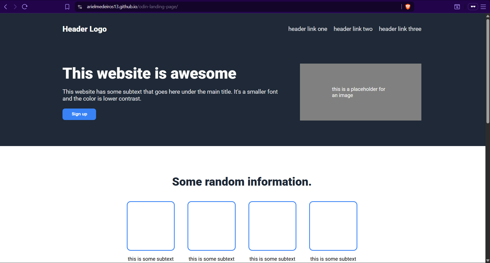

# Odin Landing Page

A simple landing page built as part of **The Odin Project – Foundations**.

The goal here was to practice layout structure and Flexbox by reproducing the provided design (desktop-focused).  
It’s not meant to be fancy or responsive yet — just clean, readable, and close to the mockup.

## Preview

Link: http://arielmedeiros13.github.io/odin-landing-page/

## Live
(Deploy with GitHub Pages and drop the link here)

## What I practiced
- HTML structure and semantic sections
- Flexbox for layout (header, hero, cards, CTA)
- Basic styling (colors, typography, spacing)
- Git workflow (commit early & often)

## Notes
This project is part of my learning path, so I kept it simple and focused on fundamentals.  
If you’re browsing it, feel free to be kind — and have fun.
